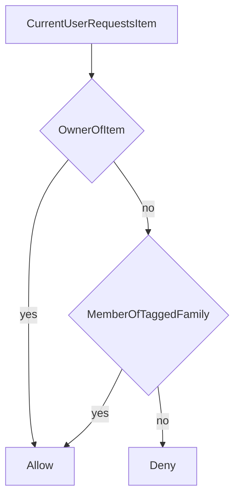

# Architecture Documentation

> Keep this file updated as features are added or architecture changes.

## Last Updated
2026-04-01

## Table of Contents
- [Overview](#overview)
- [Tech Stack Summary](#tech-stack-summary)
- [System Architecture](#system-architecture)
- [Frontend Architecture](#frontend-architecture)
- [Mock Backend (server shape)](#mock-backend-server-shape)
- [Logical Database](#logical-database)
- [API Shape](#api-shape)
- [Deployment](#deployment)
- [Development Workflow](#development-workflow)
- [Testing Strategy](#testing-strategy)

## Overview

**Heirloom** is a frontend-only SPA built with React and Create React App tooling (`react-scripts`), deployable to **Surge.sh**. It intentionally **mimics** a full-stack app: in-browser modules under `src/mockBackend/` correspond to `server/routes`, `server/services`, `server/queries`, and `server/db` so a future migration to a real Express + PostgreSQL API is mostly a transport-layer swap. Signed-out visitors use `/` for a landing page with modal username login, and signed-in users navigate through a responsive shell that keeps the desktop top-nav + sidebar experience while switching mobile to an app-style header and bottom icon navigation. Brand-new usernames are given a starter archive so the product feels lived-in immediately.

## Tech Stack Summary

- **Frontend**: React 19, React Router 6, Redux Toolkit, Ionic React (UI primitives), Tailwind CSS, React Hot Toast
- **Build / host**: `react-scripts` (CRA), static `build/` on Surge
- **Testing**: Jest (via `react-scripts`) + Testing Library
- **Backend (production)**: None — mock only
- **Database (production)**: None — see `DATABASE_SCHEMA.md` for the **logical** schema implemented in `src/mockBackend/db`

## System Architecture

### High-Level Diagram

```
[Browser / Surge CDN]
        │
        ▼
[ React + Redux + Router ]
        │
        ▼
[ helpers → mockBackend/routes → services → queries → db ]
        │
        └── (future) fetch('/api/...') → Express → PostgreSQL
```

## Frontend Architecture

### Component hierarchy

```
index.js
├── Provider (Redux)
├── NativeProvider (web placeholder)
├── BrowserRouter
└── IonApp
    └── AppRoutes
        ├── RootPage
        │   ├── Home (guest landing + modal login)
        │   │   └── UsernameSignInModal
        │   └── AppShell page="home"
        ├── AppShell page="families"
        ├── AppShell page="familyDetail"
        ├── AppShell page="items"
        ├── AppShell page="itemDetail"
        ├── AppShell page="events"
        ├── AppShell page="eventDetail"
        └── AppShell page="profile"
            ├── AppNav
            ├── DesktopSidebar (desktop only)
            ├── Mobile bottom nav (inside AppNav)
            ├── CreateRecordModal
            ├── HomePageContent
            ├── FamiliesPageContent
            ├── FamilyDetailPageContent
            ├── ItemsPageContent
            ├── EventsPageContent
            ├── EventDetailPageContent
            ├── ProfilePageContent
            └── ItemDetail
```

### State management

- **auth**: user, `isAuthenticated`, `isProfileComplete`, status
- **family**: visible families for the signed-in user
- **catalog**: visible items and loading status for the current shell
- **global**: `appName` and other cross-cutting UI state (extend per feature)

### Routing

- **`/`**
  - signed out: guest landing with a top-right `Sign In` CTA that opens a username modal
  - signed in: Home page with three quick-create entry points for items, families, and events
- **`/families`**: searchable family directory page, filterable by family name and description
- **`/families/:familyId`**: family detail page with a sticky top save bar, draft-based metadata/image edits for admins, member management, shared items, and related events
- **`/items`**: searchable item directory page of visible heirlooms, filterable by title, linked family, type, description, and owner
- **`/items/:itemId`**: item detail page with a wireframe-style top save bar, draft-based metadata/family/image edits, and immediate timeline event creation for the current owner, including optional ownership-transfer recipients
- **`/events`**: searchable event directory page across visible items, filterable by title, linked item, date, description, and creator/owner-related metadata
- **`/events/:eventId`**: event detail page with a sticky top save bar, draft-based title/item/date/description/new-owner/image edits for the event creator
- **`/profile`**: profile detail page for the signed-in user with a family-detail-style layout showing visible families plus owned items and those items' events
- **`/profile/:userId`**: read-only profile detail page for a visible user reached from linked usernames throughout the catalog UI, using the same family-detail-style lists filtered to that user's owned items and item events
- **Lazy loading**: route components use `React.lazy`

### Key contexts

- **NativeProvider** (`src/utils/NativeContext.jsx`): Surge/web shell exposes `isNative: false`; extend if you add Capacitor later.

### Configuration

- **CRA**: `react-scripts` with `public/index.html`
- **Tailwind**: `tailwind.config.js`, `src/index.css`
- **React 19 + dev server**: `npm start` sets `FAST_REFRESH=false`. CRA’s Fast Refresh (`react-refresh`) conflicts with React 19 under CRA’s `ModuleScopePlugin`; turning it off avoids that (you get full reloads on save instead of hot component updates).

### Brand (Tailwind tokens)

Use only the theme colors and font defined in `tailwind.config.js` / `src/index.css`—no arbitrary color or font utilities. Shared layout primitives such as `shell-container`, `heirloom-panel`, `heirloom-input`, and `heirloom-button` live in `src/index.css` under `@layer components` so landing, auth, nav, and catalog views stay visually aligned across desktop and mobile.

### Responsive shell

- **Desktop (`lg+`)**: sticky top navigation plus the left sidebar for recent families and heirlooms.
- **Mobile**: compact top header plus fixed bottom icon navigation for `Home`, `Families`, `Items`, `Events`, and `Profile`.
- **Detail pages**: keep the mobile bottom navigation visible and highlight the parent section so nested routes stay anchored in the same shell.
- **Landing page**: mobile-first vertical fit with modal sign-in and a swipeable "How it works" card carousel instead of an inline auth panel.

### Instrumentation impact

- **2026-04-01 mobile shell refactor**: `No event change`. This update reshapes navigation chrome, the guest sign-in presentation, and the mobile landing page walkthrough without adding analytics or behavioral instrumentation.

| Token | Tailwind | Hex |
|-------|----------|-----|
| Tomato red | `heirloom-tomato` | `#d7463c` |
| Soft yellow | `heirloom-soft-yellow` | `#f4e8a6` (pairing tone; adjust in config if marketing updates the spec) |
| Sage green | `heirloom-sage` | `#9ebf8d` |
| Warm beige | `heirloom-beige` | `#f3e8dd` |
| Earthy green | `heirloom-earthy` | `#4e7c5a` |

- **Typeface**: Architects Daughter, loaded from Google Fonts in `src/index.css` and applied globally through `fontFamily.sans` in `tailwind.config.js`.
- **Logo**: `public/heirloom-logo.png` and `public/heirloom-header-logo.png` (brand assets used in the auth screen and header). Confirm font and logo licensing for production use.

### UI Consistency Rules

- **Typography**: All app-visible type should inherit `Architects Daughter`. The global font is enforced in both Tailwind (`fontFamily.sans`) and Ionic via `--ion-font-family` in `src/index.css`.
- **Font debugging**: In development, `AppRoutes` logs computed font families for `body`, `ion-app`, `ion-content`, the first `button`, and the first `input` on route changes so font inheritance regressions are easy to spot in the console.
- **Tomato red (`heirloom-tomato`)**: Use for primary actions, active CTAs, destructive-or-important emphasis, and the strongest interactive focus.
- **Soft yellow (`heirloom-soft-yellow`)**: Use for secondary actions, selected-but-not-primary states, warm badges, and gentle callouts.
- **Sage green (`heirloom-sage`)**: Use for supportive hover states, success-adjacent accents, and lighter metadata chips.
- **Warm beige (`heirloom-beige`)**: Use for page background, subtle surfaces, empty-state containers, and low-emphasis fills.
- **Earthy green (`heirloom-earthy`)**: Use for primary text, borders, icons, separators, and structural chrome.
- **Avoid**: introducing new color semantics ad hoc. When a new component needs emphasis, map it to one of the roles above first and only expand the palette intentionally.

## Mock Backend (server shape)

| Full-stack template | Heirloom |
|---------------------|----------|
| `server/db/index.js` | `src/mockBackend/db/index.js` |
| `server/queries/*` | `src/mockBackend/queries/*` |
| `server/services/*` | `src/mockBackend/services/*` |
| `server/routes/*` | `src/mockBackend/routes/*` |

**Request flow (conceptual)**  
UI → `helpers/*` → `mockBackend/routes` → `services` → `queries` → in-memory store (optional `localStorage` persistence hooks in `db/index.js`).

### Current mock resources

- `auth`: login, me, logout
- `families`: list my families, create family, add family member
- `families`: update family details and family photo for the current session
- `items`: list visible items, create item (which seeds a first `Received item` event), update item details, retag item families
- `items`: update item photo for the current session
- `events`: add an item event only when the current user owns the item, update an item event, capture optional ownership-transfer recipients, and attach an event image for the current session

## Logical Database

Authoritative documentation: **`DATABASE_SCHEMA.md`**. The mock db now includes users, families, memberships, items, item-family links, and item events.

### Visibility model



- A user can belong to multiple families.
- An item with no family tags is private to its owner.
- An item tagged to one or more families is visible to members of those tagged families and the owner.
- Item events inherit visibility from their parent item.

## API Shape

When replacing mocks with a real backend, target the same JSON envelopes the mock services return today, for example:

- **POST login (conceptual)**: accepts `{ username }`, ensures a mock user record exists, and returns `{ user, isProfileComplete }`
- **GET my families**: `{ families }`
- **PUT family**: `{ family }`
- **PUT family photo**: `{ family }`
- **GET visible items**: `{ items }`
- **POST family**: `{ family }`
- **POST item**: `{ item }`
- **PUT item**: `{ item }`
- **PUT item families**: `{ item }`
- **POST item event**: accepts `{ itemId, title, description, occurredOn, newOwnerUserId?, imageFile? }` and returns `{ event }`
- **PUT item event**: accepts `{ itemEventId, itemId, title, description, occurredOn, newOwnerUserId?, imageFile? }` and returns `{ event }`

## Deployment

### Surge

1. `npm run build`
2. `npx surge build your-domain.surge.sh`  
   or use `npm run deploy:surge` if the Surge CLI is installed globally.

### Notes

- **No SSR**: all data is client-side or from future real APIs.
- **CSP**: basic policy in `index.html`; relax only when you add trusted third-party origins.

## Development Workflow

1. Add UI under `src/components/` / `src/routes/`.
2. Add feature helpers under `src/helpers/`.
3. Mirror server layers under `src/mockBackend/` (`queries` → `services` → `routes`).
4. Keep visibility and ownership rules centralized in services.
5. Update **`ARCHITECTURE.md`** and **`DATABASE_SCHEMA.md`** when behavior or schema changes.
6. Add tests under `src/tests/` for UI flow and mock-business rules.

## Testing Strategy

- **Unit / component**: Jest + Testing Library in `src/tests/`
- **Integration coverage**: app shell route navigation, quick-create modal flows, family/item visibility rules, searchable directory pages, family-detail/item-detail/event-detail draft/save behavior, and record editing/authorization checks
- **Shared fetch mocks**: `src/tests/__mocks__/fetchMocks.js` when you introduce real `fetch` calls

## Known Limitations

- Mock auth session is in-memory (lost on full page reload).
- Uploaded item, family, and event images are stored only as in-memory object URLs for the current session.
- Item-detail saves are initiated with one top-level save action in the UI, but the mock shell still persists metadata, family tags, and image changes through sequential helper calls rather than a transactional backend endpoint.
- Family-detail saves are initiated with one top-level save action in the UI, but the mock shell still persists metadata and image changes through sequential helper calls rather than a transactional backend endpoint.
- Event-detail saves are initiated with one top-level save action in the UI, but the mock shell still persists metadata and image changes through sequential helper calls rather than a transactional backend endpoint.
- Families currently behave as groups; deeper genealogy edges between families are intentionally deferred.
- Ownership transfer is represented through item metadata plus `item_events.new_owner_user_id` history rather than a dedicated transfer table.
- Ionic `routerLink` is not used; navigation uses React Router (`useNavigate` / `Link`).

## Future Improvements

- Optional **MSW** or **OpenAPI**-generated client when backend exists.
- **Capacitor** if you need native shells; align with `APP_SHELL_PROMPT.md` native section.
