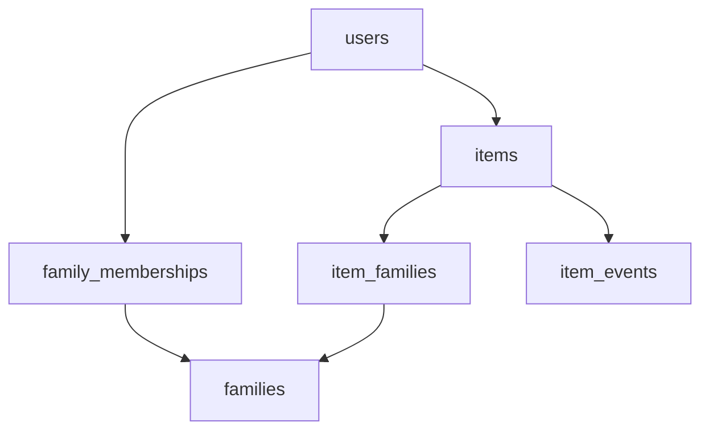

# Database Schema Documentation

> **IMPORTANT**: For Heirloom, this describes the **logical** schema your mock (`src/mockBackend`) and future PostgreSQL database should align with. Update this file whenever you add tables or fields.

## Last Updated
2026-04-01

## Overview

Heirloom now uses a mock MVP schema centered on private heirloom cataloging with optional family sharing. A signed-in user can:

- create or reuse a username-only mock account
- receive starter families, items, and events for new usernames so the mock app feels already in use
- create families (groups)
- join users to families
- create items that are private by default
- create items that immediately seed a first `Received item` timeline event dated to the item creation day
- share items with one or more families
- attach timeline events to items

An item is **private** when it has no `item_families` rows. Once tagged to one or more families, only members of those tagged families can view it.

## Tables

### users

- **Purpose**: Account records used for mock auth, ownership, and family membership.
- **Columns**:
  - `user_id` (INTEGER, primary key) — synthetic id in mock; `SERIAL` in Postgres
  - `username` (TEXT UNIQUE NOT NULL)
  - `email` (TEXT)
  - `password` (TEXT, nullable in mock) — bcrypt hash in production
  - `created_at` (TIMESTAMPTZ / ISO string in mock)
- **Primary Key**: `user_id`
- **Indexes**: `username` (unique)
- **Foreign Keys**: none
- **Last Modified**: 2026-03-30
- **Mock Notes**:
  - If a visitor types a new username on `/`, the auth service creates a mock user record so items, memberships, and events have a stable `user_id`.

### families

- **Purpose**: Groups of related people who should be able to view shared heirlooms.
- **Columns**:
  - `family_id` (INTEGER, primary key)
  - `name` (TEXT NOT NULL)
  - `description` (TEXT)
  - `created_by_user_id` (INTEGER NOT NULL)
  - `photo_url` (TEXT) - seeded asset URL or session-only object URL in the mock when a family image is uploaded
  - `photo_name` (TEXT)
  - `created_at` (TIMESTAMPTZ / ISO string in mock)
- **Primary Key**: `family_id`
- **Indexes**: `created_by_user_id`
- **Foreign Keys**:
  - `created_by_user_id` → `users.user_id`
- **Last Modified**: 2026-04-01
- **Behavior Notes**:
  - Family admins can update family metadata, add members, and change the family image.
  - Family images are seeded asset URLs by default and become session-only object URLs when a new image is uploaded in the mock.

### family_memberships

- **Purpose**: Many-to-many link between users and families.
- **Columns**:
  - `membership_id` (INTEGER, primary key)
  - `family_id` (INTEGER NOT NULL)
  - `user_id` (INTEGER NOT NULL)
  - `role` (TEXT NOT NULL) — `admin` or `member` in the mock MVP
  - `created_at` (TIMESTAMPTZ / ISO string in mock)
- **Primary Key**: `membership_id`
- **Indexes**:
  - (`family_id`, `user_id`) unique
  - `user_id`
- **Foreign Keys**:
  - `family_id` → `families.family_id`
  - `user_id` → `users.user_id`
- **Last Modified**: 2026-03-30

### items

- **Purpose**: Cataloged heirlooms, collectibles, or meaningful objects.
- **Columns**:
  - `item_id` (INTEGER, primary key)
  - `owner_user_id` (INTEGER NOT NULL)
  - `created_by_user_id` (INTEGER NOT NULL)
  - `title` (TEXT NOT NULL)
  - `type` (TEXT)
  - `description` (TEXT)
  - `year_made` (TEXT)
  - `date_received` (DATE / ISO date string in mock)
  - `photo_url` (TEXT) — session-only object URL in the mock when an image is uploaded
  - `photo_name` (TEXT)
  - `created_at` (TIMESTAMPTZ / ISO string in mock)
- **Primary Key**: `item_id`
- **Indexes**:
  - `owner_user_id`
  - `created_by_user_id`
- **Foreign Keys**:
  - `owner_user_id` → `users.user_id`
  - `created_by_user_id` → `users.user_id`
- **Last Modified**: 2026-03-30
- **Visibility Rule**:
  - If an item has no `item_families` rows, it is visible only to `owner_user_id`.
  - If an item has one or more `item_families` rows, it is visible to its owner and members of any tagged family.
- **Behavior Notes**:
  - Creating an item also creates one initial `item_events` row titled `Received item` using the item creation date for `occurred_on`.

### item_families

- **Purpose**: Many-to-many link assigning an item to one or more families.
- **Columns**:
  - `item_family_id` (INTEGER, primary key)
  - `item_id` (INTEGER NOT NULL)
  - `family_id` (INTEGER NOT NULL)
  - `created_at` (TIMESTAMPTZ / ISO string in mock)
- **Primary Key**: `item_family_id`
- **Indexes**:
  - (`item_id`, `family_id`) unique
  - `family_id`
- **Foreign Keys**:
  - `item_id` → `items.item_id`
  - `family_id` → `families.family_id`
- **Last Modified**: 2026-03-30

### item_events

- **Purpose**: Timeline entries, story beats, ownership notes, and major moments tied to an item.
- **Columns**:
  - `item_event_id` (INTEGER, primary key)
  - `item_id` (INTEGER NOT NULL)
  - `title` (TEXT NOT NULL)
  - `description` (TEXT)
  - `occurred_on` (DATE / ISO date string in mock)
  - `new_owner_user_id` (INTEGER, nullable) - optional recipient when the event records an ownership transfer
  - `photo_url` (TEXT) - seeded asset URL or session-only object URL in the mock when an event image is uploaded
  - `photo_name` (TEXT)
  - `created_by_user_id` (INTEGER NOT NULL)
  - `created_at` (TIMESTAMPTZ / ISO string in mock)
- **Primary Key**: `item_event_id`
- **Indexes**:
  - `item_id`
  - `created_by_user_id`
- **Foreign Keys**:
  - `item_id` → `items.item_id`
  - `new_owner_user_id` → `users.user_id`
  - `created_by_user_id` → `users.user_id`
- **Last Modified**: 2026-04-01
- **Visibility Rule**:
  - Events inherit visibility from their parent item.
- **Behavior Notes**:
  - New items always seed a first event titled `Received item`.
  - Item-detail timelines are ordered by `occurred_on` rather than `created_at`.
  - When an event includes `new_owner_user_id`, the mock service recalculates `items.owner_user_id` from the item's transfer history so current owner metadata matches the latest dated ownership-transfer event.
  - Event images are seeded asset URLs by default and become session-only object URLs when a new image is uploaded in the mock.

### sessions

- **Purpose**: Reserved for future session-store documentation (e.g. `connect-pg-simple`). The static app currently uses an in-memory session in `authService.js`.
- **Columns**: TBD when a real backend exists.
- **Last Modified**: 2026-03-30

---

## Relationships Diagram

---

## Migration History

### 2026-03-31 - Item detail draft save flow

- **Description**: Documented the rule that item creation now seeds a first `Received item` event and that item timelines are treated as event-date ordered history.
- **Tables Changed**: none (behavioral contract update only)
- **Breaking Changes**: none

### 2026-04-01 - Family image fields

- **Description**: Added logical family image fields so family list/detail views can mirror item image treatment while keeping uploads session-only in the mock.
- **Tables Changed**: `families`
- **Breaking Changes**: none

### 2026-04-01 - Event image fields

- **Description**: Added logical event image fields so event list/detail views can mirror item and family image treatment while keeping uploads session-only in the mock.
- **Tables Changed**: `item_events`
- **Breaking Changes**: none

### 2026-04-01 - Ownership transfer event field

- **Description**: Added optional `new_owner_user_id` on `item_events` so ownership-transfer timeline entries can name the recipient and keep `items.owner_user_id` synchronized with the latest transfer event in mock history.
- **Tables Changed**: `item_events`, `items` (behavioral sync only)
- **Breaking Changes**: none

### 2026-03-30 - Business MVP schema

- **Description**: Expanded the logical schema from starter auth-only records to a family/item/event model with many-to-many sharing.
- **Tables Created**: `families`, `family_memberships`, `items`, `item_families`, `item_events` (logical)
- **Breaking Changes**: none

---

## Notes

- Mock data initializer: `src/mockBackend/db/index.js`
- Visibility rules are enforced in the mock services, not just the UI.
- Uploaded item images are intentionally session-only and are not saved to localStorage or a backend.
- Ownership transfer is represented as item metadata plus event history in the MVP rather than a dedicated lineage graph or transfer table.
- When moving to PostgreSQL, add triggers, constraints, and real session storage here first, then implement in SQL.
